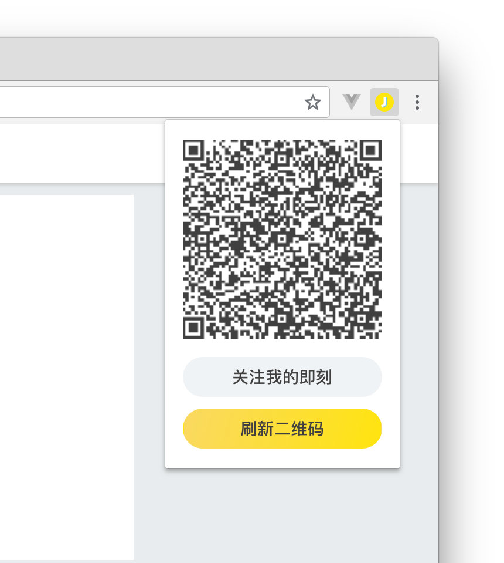
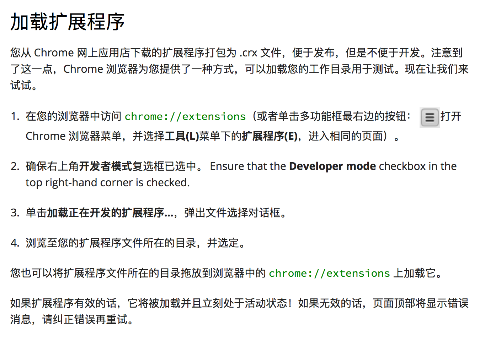

# Jike Web QR
 即刻 Web 二维码登录插件，无需跳转登录界面即可实现登录。

---

该项目用到的皆为入门级 Chrome API，使用了 [jQuery 3](https://jquery.com)、[qrcode.js](https://github.com/davidshimjs/qrcodejs) 两个第三方库，基于即刻 Web API 和简单的 Popup => external js 交互逻辑实现。目前可实现的功能如下：

* 获取 Session 并创建二维码供扫描登录
* 可手动刷新二维码
* 登出即刻 Web

对于未来的展望：

* 在保证安全的前提下，实现「一键登录」功能

实际效果参考（图中二维码已失效）：

由于该插件未打包，所以您需要自行安装，方法见图：

**该项目仅供学习使用！**  
**该项目开源已获得即刻 CEO @瓦总的许可。**