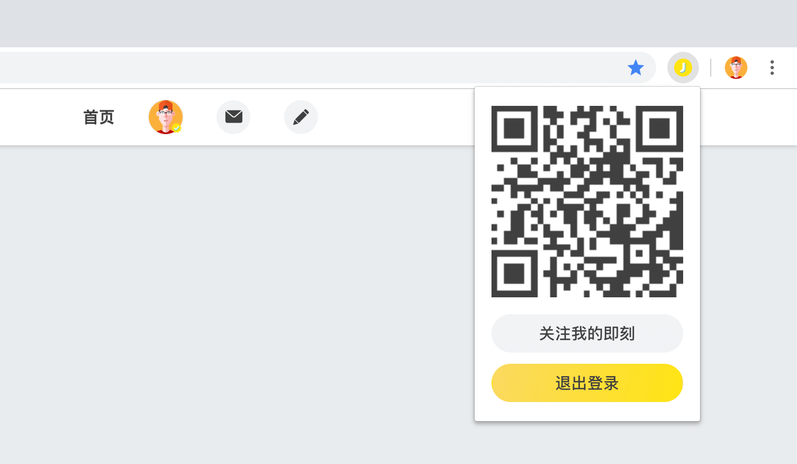

# Jike Web QR
 即刻 Web 二维码登录插件，无需跳转登录界面即可实现登录。

 

---

该项目用到的皆为入门级 Chrome API，使用了 [jQuery 3](https://jquery.com)、[qrcode.js](https://github.com/davidshimjs/qrcodejs) 两个第三方库，基于即刻 Web API 和简单的 Popup > external js 交互逻辑实现。目前可实现的功能如下：

* 获取 Session 并创建二维码供扫描登录
* 可手动刷新二维码
* 登出即刻 Web
* 一次扫描永久登录

对于未来的展望：

* 将项目完全迁移至 Vue.js

由于该插件未打包，所以您需要自行安装，方法见图：

1. 下载源代码并解压缩
2. 打开 More Tools > Extensions
3. 点击左上方 Load unpacked
4. 选择解压缩后的文件夹

**该项目仅供学习使用！**  
**该项目开源已获得即刻 CEO @瓦总的许可。**