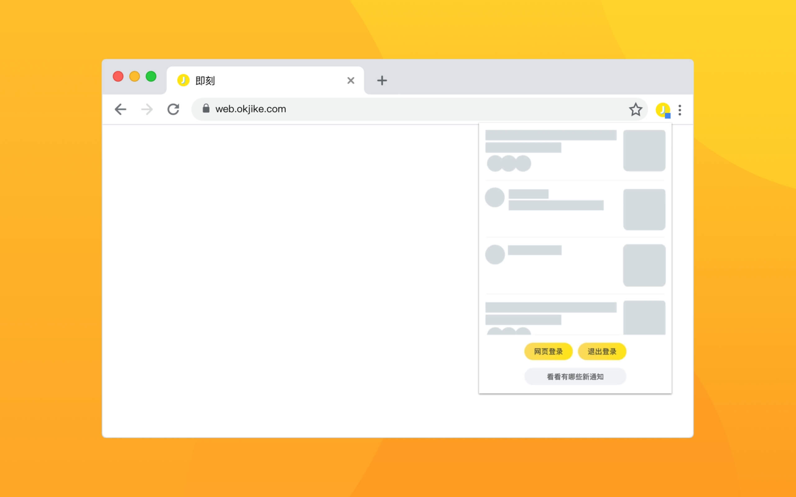
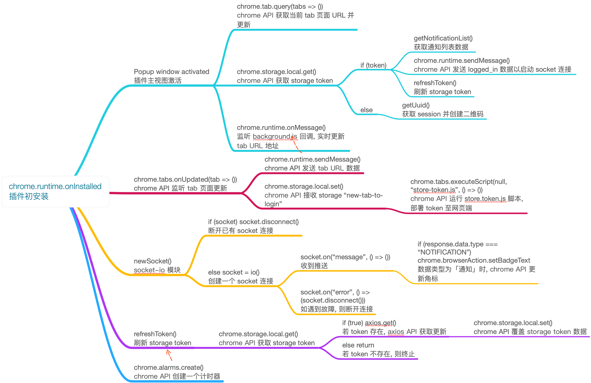

# 即刻喵 🐱 for Microsoft Edge

**本仓库为原 Chrome 原生拓展插件移植到 Microsoft Edge 浏览器的版本。原仓库地址：[Jike Meow](https://github.com/coder-ysj/jike-meow)，正在 beta 测试中。**

基于 Vue.js 和 Socket.io 开发的第三方即刻通知插件。

## 主要功能

* 📦 一键登录 - 不仅插件本身可以登录，还能登录网页端
* 📡 未读通知 - 实时显示未读通知数量，摸鱼党的专属功能
* 🚀 消息列表 - 无需即刻 App，直接查看详细的通知内容
* 😉 保护隐私 - 不收集任何个人信息，不对接任何第三方平台

## 项目结构

* **./images** Chrome Store, GitHub, 图标等素材
* **./scripts** 引用的第三方库和 Content Scripts
* **./scripts/store-token.js** 「网页登录」脚本
* **background.js** 「开启消息通知角标」脚本
* **popup.js** 插件主视图的功能

## 源代码安装方法

1. 下载项目的源代码并解压缩到任意文件夹中
2. 打开 Chrome 浏览器并进入到 More Tools > Extensions 页面
3. 点击左上角 Load unpacked 选择解压缩后的文件夹
4. 确认即可完成安装

## 前言

不同于标准的前端开发，Chrome Extensions 拥有完全不同的 API 和底层设计，但这些并不影响你通过 React 或 Vue 类似的框架，来构建一个完整的 Chrome 应用，甚至还能在 GitHub 上找到一些第三方「脚手架」来达到这一目的。前提是你得熟悉项目的结构和基本规范。

这里提供两个我用于参考的文档链接，它们对于这个项目起到了至关重要的作用。感谢 [翻译者们](https://plus.google.com/+Crxdoc-zhAppspot) 的辛苦制作。

* 官方开发文档：[传送门](https://developer.chrome.com/extensions)
* 非官方中文开发文档：[传送门](https://crxdoc-zh.appspot.com/extensions)

**特别感谢 [@糯米鸡](http://m.okjike.com/user/viko16) 提供的巨大帮助！️**❤️

## 逻辑示意图

## F.A.Q

**问：为什么不支持点赞、回复这样的功能？**

答：这些都是和用户行为有关的特性，需要经过极为的测试才能上线，否则很容易导致不必要的误会。由于这是个第三方插件，对接流程并不走官方渠道，所以暂时不会考虑上线这样的功能。

**问：访问不了 Chrome Store 有什么办法解决吗？**

这是个开源项目，并且与你的隐私信息有关，因此，一个值得信赖的安装渠道是十分重要的，这样不仅能够避免被他人篡改，也可以保护你的隐私，显然 [Chrome Store](https://chrome.google.com/webstore/detail/jike-web-qr/gahlkoaglgmbpjoecaahganpccafojaa?hl=zh-CN) 是「唯一」的选择，还请谅解。当然了，作为开发者我可以承诺，绝不收集你的任何隐私信息。

**问：接下来的版本还会更新功能吗？**

会，只要版本号小数点后一位有变化，就会加入新特性，例如 1.0.0 > 1.1.0 这样。但 1.0.0 > 1.0.1 通常只是维护性的升级。但无论是何种情况，我都希望每一位用户能及时地更新至最新版本。

## TODO

- [x] 左下角显示时间
- [x] 正式上线「后台获取未读消息数量」功能
- [x] 记录上次阅读位置
- [x] 手动刷新通知列表
- [x] 加入对「问答」类型的通知支持