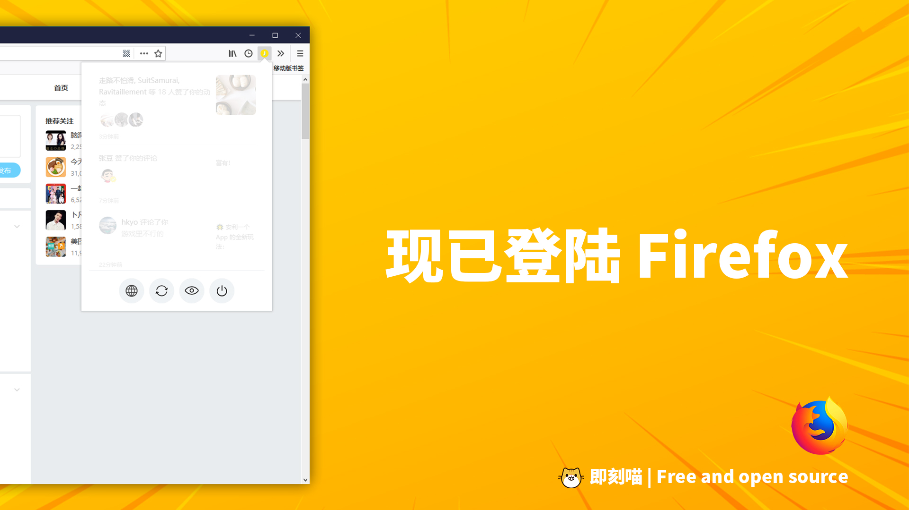

# 即刻喵 🐱 for Firefox

> And maybe for Edge, who knows. 😀

> 「即刻喵」是一个为社区平台「即刻」开发的 Chrome 浏览器插件，主要弥补了网页端无法查看消息内容的缺陷，让「即刻」用户能够在不接触手机的前提下，尽可能得到接近客户端的完整体验。

基于 Vue.js 和 Socket.io 开发的第三方即刻通知插件。

**❗❗❗ 现已支持火狐。正式！安排！**

## ❗ 说明

本仓库为原 Chrome 原生拓展插件移植到 Firefox 和 Microsoft Edge 浏览器的版本。原仓库地址：[Jike Meow](https://github.com/coder-ysj/jike-meow)，本插件 Microsoft Edge 版本正在 beta 测试中。

## Firefox 安装

下载地址：

## Microsoft Edge 测试安装方法

> 测试中，仅支持单次安装，出现 bug 请积极反馈 🎉

1. 将本仓库下载并解压缩到任意文件夹中；
2. 依照微软官方支持文档 [Adding, moving, and removing extensions for Microsoft Edge](https://docs.microsoft.com/en-us/microsoft-edge/extensions/guides/adding-and-removing-extensions) 介绍，开启 Edge 开发者模式，允许未签名插件安装；
3. 选择「更多 > 扩展 > 加载扩展」，然后选择刚刚下载的文件夹中 `jike-meow-edge` 文件夹；
4. 这样就完成了本插件的安装。
5. **请注意，这种加载模式是旁加载模式，由于安全问题，Edge 浏览器并不会全时允许插件的运行，如果重启电脑或长时间之后才重新打开 Edge 浏览器，请手动到扩展列表重新启用「即刻喵」。Edge 兼容性仍在开发检验中，使用步骤繁琐还请理解。**

## 主要功能

* 📦 一键登录 - 不仅插件本身可以登录，还能登录网页端
* 📡 未读通知 - 实时显示未读通知数量，摸鱼党的专属功能
* 🚀 消息列表 - 无需即刻 App，直接查看详细的通知内容
* 😉 保护隐私 - 不收集任何个人信息，不对接任何第三方平台

## 项目结构

### 项目目录结构

- **./jike-meow-edge** Microsoft Edge 版本即刻喵 🐱
- **./jike-meow-firefox** Firefox 版本即刻喵 🐱
- **./images** Chrome Store, AMO, GitHub, 图标等素材

### 插件源码目录结构（`./jike-meow-firefox` 文件夹下内容）

- **./images** Chrome Store, AMO, GitHub, 图标等素材
- **./scripts** 引用的第三方库和 Content Scripts
- **./scripts/store-token.js** 「网页登录」脚本
- **background.js** 「开启消息通知角标」脚本
- **popup.js** 插件主视图的功能

## ~~源代码安装方法~~

> 已失效。请到原仓库安装 Chrome 版本的扩展插件。

1. ~~下载项目的源代码并解压缩到任意文件夹中~~
2. ~~打开 Chrome 浏览器并进入到 More Tools > Extensions 页面~~
3. ~~点击左上角 Load unpacked 选择解压缩后的文件夹~~
4. ~~确认即可完成安装~~

## 建议与支持

原仓库位于 [coder-ysj/jike-meow](https://github.com/coder-ysj/jike-meow)，由大佬 [Ⓙcoder_ysj](https://web.okjike.com/user/F39BF844-7BF9-4754-8E7C-189CA3A35644/post) 亲手打造，欢迎 Star 原仓库！🌟🌟🌟

当然也欢迎 Star 本仓库，让我们共同帮扶即刻做大做强！💪

---

**🐱 Jike Meow for Firefox** ©Spencer Woo. Released under the MIT License. 

Originally created by [Ⓙcoder-ysj](https://web.okjike.com/user/F39BF844-7BF9-4754-8E7C-189CA3A35644/post).

Transplanted and maintained by Spencer Woo.

[@Blog](https://spencerwoo.com/) · [ⒿJike](https://web.okjike.com/user/4DDA0425-FB41-4188-89E4-952CA15E3C5E/post) · [@GitHub](https://github.com/spencerwoo98)
